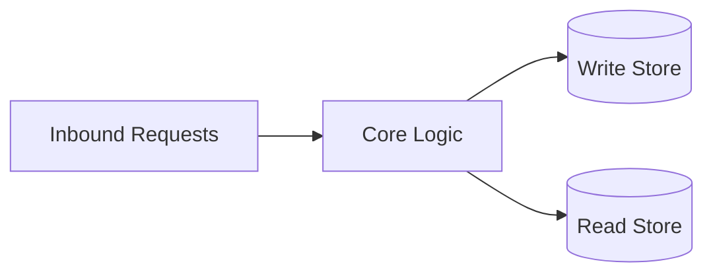
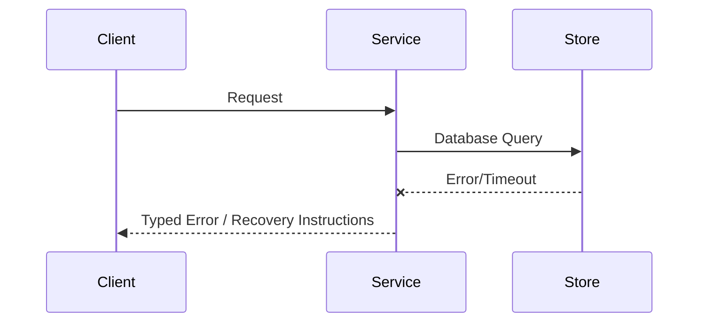

# Architecture


<!-- decapod:capability-overlay:persistent-state:start -->


## Persistent State Architecture Overlay

### State Ownership
- Each entity type MUST have a designated state owner
- State ownership boundaries MUST be explicitly documented
- Cross-boundary state access MUST go through defined interfaces

### Transaction Boundaries
- All multi-entity mutations MUST occur within explicit transactions
- Transaction boundaries MUST be documented in ARCHITECTURE.md
- Compensating transactions for distributed operations

### Storage Abstraction
- Storage ownership, consistency behavior, and access boundaries MUST be explicit
- Portability or swappable implementations are project decisions, not universal requirements
- Migration and rollback treatment MUST match the selected storage technology
<!-- decapod:capability-overlay:persistent-state:end -->
## Direction
infra

## What This Project Is
flowhawk is a service_or_library project built using Go.
infra

Architectural principles:
- **Simplicity**: Keep components focused and reusable.
- **Modularity**: Clearly defined interface boundaries and dependency separation.
- **Reliability**: Graceful failure handling and thorough verification.

## Current Facts
- Runtime/languages: Go
- Detected surfaces/framework hints: go, shell
- Product type: service_or_library

## Architecture Map
This project's architecture consists of the following key layers/directories:
- `src/`: Main source directory containing primary logic.
- `tests/`: Integration and unit test suite.

## Data Flows
- Inbound request/command parses and validates at the entrypoint.
- Core runtime handles business logic and initiates queries or state changes.
- Storage adapter reads or writes data to the underlying persistence layers.

## Strongest Existing Primitives
- Define the strongest existing primitives in the codebase (e.g., helper utilities, base controllers, data access layers).

## Topology
```text
Host Application -> Library API -> Domain Core -> Adapters (Store / Network)
```

## Store Boundaries


## Happy Path Sequence
```text
Client request -> API validation -> domain execution -> persistence -> response with trace id
```

## Error Path


## Execution Path
- Ingress parse + validation:
- Policy/interlock checks:
- Core execution + persistence:
- Verification and artifact emission:

## Concurrency and Runtime Model
- Execution model:
- Isolation boundaries:
- Backpressure strategy:
- Shared state synchronization:

## Deployment Topology
- Runtime units:
- Region/zone model:
- Rollout strategy (blue/green/canary):
- Rollback trigger and blast-radius scope:

## Data and Contracts
- Inbound contracts (CLI/API/events):
- Outbound dependencies (datastores/queues/external APIs):
- Data ownership boundaries:
- Schema evolution + migration policy:

## ADR Register
| ADR | Title | Status | Rationale | Date |
|---|---|---|---|---|
| ADR-001 | Initial topology choice | Proposed | Define first stable architecture | YYYY-MM-DD |

## Delivery Plan (first 3 slices)
- Slice 1 (ship first):
- Slice 2:
- Slice 3:

## Risks and Mitigations
| Risk | Likelihood | Impact | Mitigation |
|---|---|---|---|
| Contract drift across components | Medium | High | Spec + schema checks in CI |
| Runtime saturation under peak load | Medium | High | Capacity model + load tests |

<!-- decapod:codebase-attestation:start -->
## Codebase Attestation

- Repository signal fingerprint: `3dc97c87e5401003fe80f8487318bdb19e61036d8f22ae73bd87da7acb2831db`
- Significant implementation surfaces: `.github/` (4 files), `Dockerfile/` (1 files), `Makefile/` (1 files), `README.md/` (1 files), `docker-compose.yml/` (1 files), `examples/` (2 files), `go.mod/` (1 files), `go.sum/` (1 files), `tests/` (1 files)
- Refreshed from the current codebase by `decapod specs.refresh`
<!-- decapod:codebase-attestation:end -->
