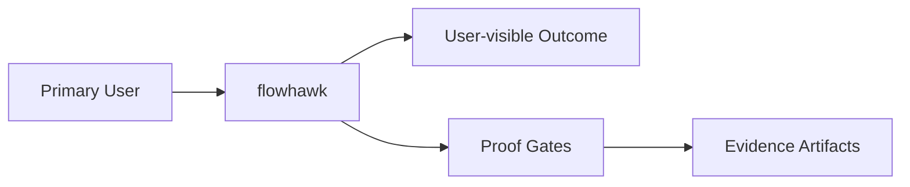

# Intent

<!-- decapod:declared-capabilities:start -->

## Declared Capability Surfaces

- `authentication`
- `background-processing`
- `event-driven`
- `external-integrations`
- `infrastructure-management`
- `persistent-state`
- `public-api`
- `scheduled-jobs`
- `secrets-handling`

<!-- decapod:declared-capabilities:end -->
## Product Outcome
- 

## What This Project Is
flowhawk is a service_or_library project built using Go.

Key operating facts:
- **Primary languages**: Go
- **Detected surfaces**: go, shell

## Product View

## Inferred Baseline
- Repository: flowhawk
- Product type: service_or_library
- Primary languages: Go
- Detected surfaces: go, shell

## Scope
| Area | In Scope | Proof Surface |
|---|---|---|
| Core workflow | Define a concrete user-visible workflow | Acceptance criteria + tests |
| Data contracts | Document canonical inputs/outputs | [INTERFACES.md](./INTERFACES.md) and schema checks |
| Delivery quality | Block promotion on broken proof surfaces | [VALIDATION.md](./VALIDATION.md) blocking gates |

## Non-Goals (Falsifiable)
| Non-goal | How to falsify |
|---|---|
| Feature creep beyond the primary outcome | Any PR adds capability not tied to outcome criteria |
| Shipping without evidence | Missing validation artifacts for promoted changes |
| Ambiguous ownership boundaries | Missing owner/system-of-record in interfaces |

## Constraints
- Technical: runtime, dependency, and topology boundaries are explicit.
- Operational: deployment, rollback, and incident ownership are defined.
- Security/compliance: sensitive data handling and authz are mandatory.

## Acceptance Criteria (must be objectively testable)
- [ ] Decapod validate passes, required tests pass, and promotion-relevant artifacts are present.
- [ ] Non-functional targets are met (latency, reliability, cost, etc.).
- [ ] Validation gates pass and artifacts are attached.
- [ ] `go test ./...` passes for all packages
- [ ] `go vet ./...` passes with no diagnostics
- [ ] `gofmt -l .` returns no files

## Epistemic Custody Fields

### Active Assumptions
- [ ] List any assumptions made to proceed.
- [ ] Flag assumptions that require future verification.

### Confidence & Risk Level
- **Confidence**: Low/Medium/High (Rationale: )
- **Risk**: Low/Medium/High (Impact of wrong assumptions: )

### Measured vs Inferred Facts
| Fact | Source (Provenance) | Type (Measured/Inferred) |
|---|---|---|
| | | |

### Unresolved Contradictions
- [ ] List any evidence that conflicts with current assumptions or intent.

### Deferred Questions
- [ ] Questions to be answered later.

### Stop Conditions
- [ ] Explicit conditions under which the agent should stop and ask for help.

### Proof Required Before Completion
- [ ] Specific evidence needed to prove the outcome is met.

## Tradeoffs Register
| Decision | Benefit | Cost | Review Trigger |
|---|---|---|---|
| Simplicity vs extensibility | Faster iteration | Potential rework | Feature set expands |
| Strict gates vs dev speed | Higher confidence | More upfront discipline | Lead time regressions |

## First Implementation Slice
- [ ] Define the smallest user-visible workflow to ship first.
- [ ] Define required data/contracts for that workflow.
- [ ] Define what is intentionally postponed until v2.

## Open Questions (with decision deadlines)
| Question | Owner | Deadline | Decision |
|---|---|---|---|
| Which interfaces are versioned at launch? | TBD | YYYY-MM-DD | |
| Which non-functional target is hardest to hit? | TBD | YYYY-MM-DD | |

<!-- decapod:codebase-attestation:start -->
## Codebase Attestation

- Repository signal fingerprint: `0b2f71011578e9a165366e1c2f8f88ce53486ce97d7b3d0d5efced454f401840`
- Significant implementation surfaces: `.github/` (4 files), `Dockerfile/` (1 files), `Makefile/` (1 files), `README.md/` (1 files), `docker-compose.yml/` (1 files), `examples/` (2 files), `go.mod/` (1 files), `go.sum/` (1 files), `tests/` (1 files)
- Refreshed from the current codebase by `decapod specs.refresh`
<!-- decapod:codebase-attestation:end -->
